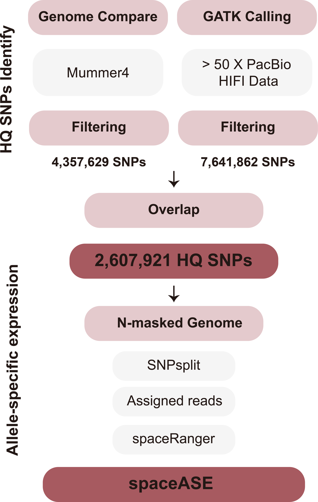

# 🌽 Hybrid Maize Spatial Transcriptomics

This repository contains the analysis code for the paper:
**_Spatial and cell-type heterogeneity of gene imprinting in maize_**.

## 🧬 spaseASE Overview

  

**spaseASE** is a workflow for spatially resolving allele-specific expression (ASE) patterns in hybrid maize kernels.
It integrates long-read genotyping, SNP-based phasing, and spatial transcriptomic mapping.

## 📂 Repository Contents

- **`spaseASE/`**:A spatial transcriptomic parental genotyping pipeline based on SNPs, implemented using WDL.
- **`scripts/`**: Custom WDL workflows used in this study for processing other sequencing data.
- **`docker/`** – Dockerfiles for building reproducible computational environments required by `spaseASE`.

## 🧪 Citation

If you use this repository or `spaseASE` in your work, please cite:

## 📧 Contact

If you have any questions, please contact Tao Li at litao1503@outlook.com, or leave an Issue.

